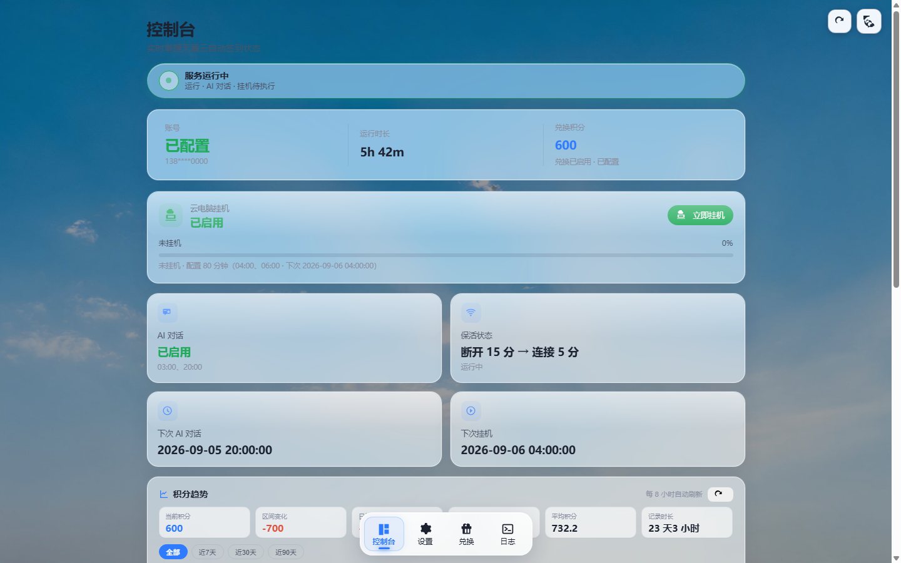
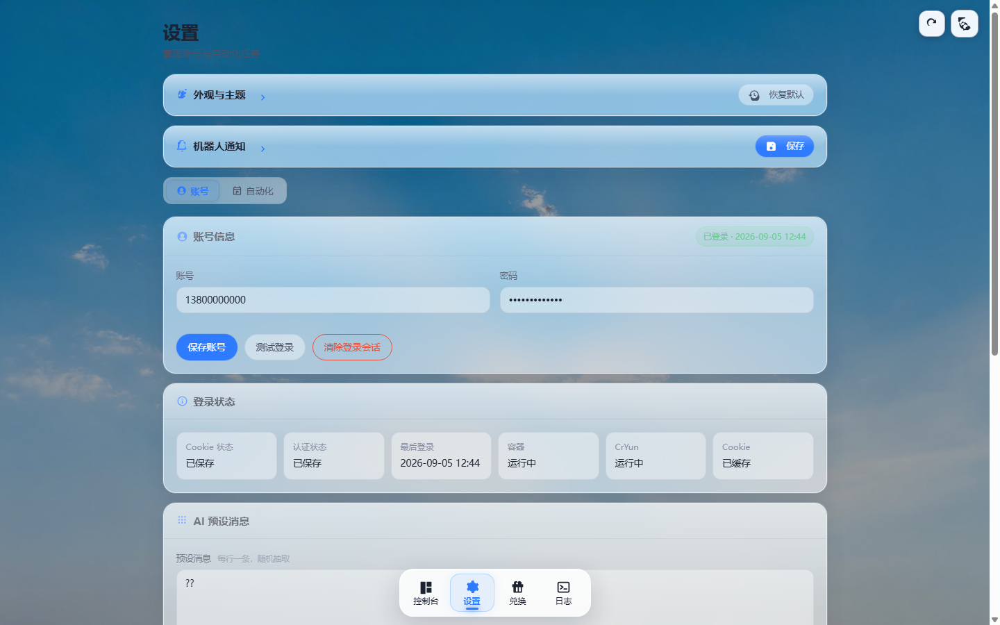
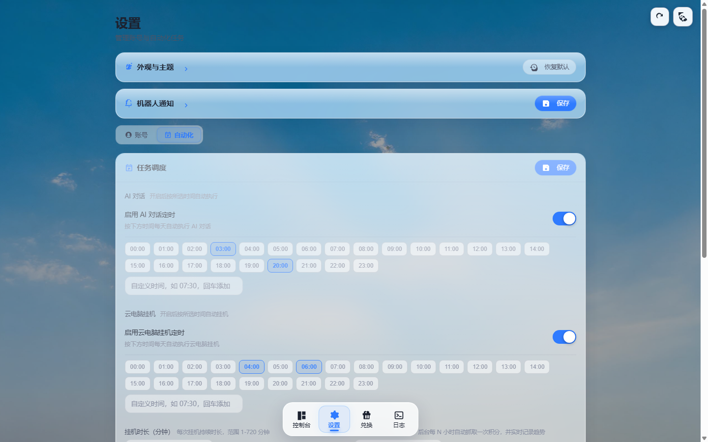
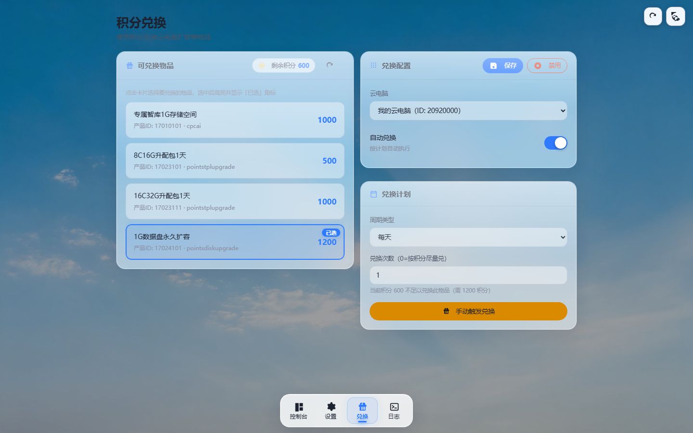
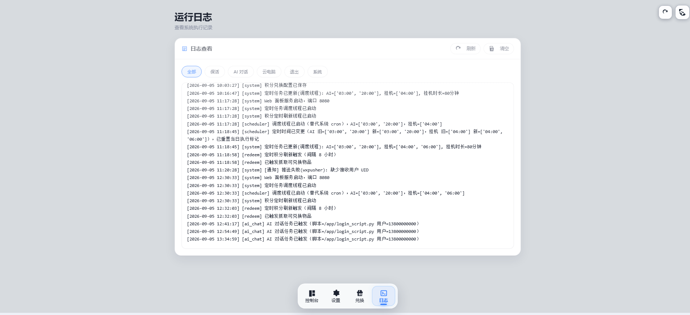
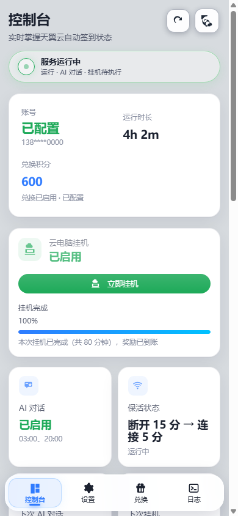

---
AIGC:
  ContentProducer: '001191110102MAD55U9H0F10002'
  ContentPropagator: '001191110102MAD55U9H0F10002'
  Label: '1'
  ProduceID: '824dd083-f89f-4a78-af8b-c9399eaf8001'
  PropagateID: '824dd083-f89f-4a78-af8b-c9399eaf8001'
  ReservedCode1: '3c57bfa8-783c-4b44-a061-e2e30494f9d3'
  ReservedCode2: '3c57bfa8-783c-4b44-a061-e2e30494f9d3'
---

# 天翼云电脑保活自动化 + Web 管理面板

<p align="center">
  
</p>

   

在 Docker 容器中保活天翼云电脑使其长期在线，并自动完成每日积分任务（AI 对话 +100、挂机 +100、保活积分），支持积分自动兑换。内置 Web 管理面板，浏览器里即可完成全部配置，无需改任何代码。

> 本仓库为**脱敏开源版**：不含任何账号、Cookie、服务器地址等个人信息，所有配置在首次启动后通过 Web 面板填写。

## 功能特性

- **云电脑保活**：周期性连接保活，支持保活间隔/开关的面板热配置
- **AI 对话任务**：无头浏览器自动登录 → 发送预设消息 → 等待 AI 回复 → 领取积分
- **挂机任务**：自动登录云电脑挂机满时长领取积分
- **调度器**：面板可视化配置定时时间，**按"时间点"级去重**（同日多个时间点均会执行），时间变更自动重置当日标记
- **积分兑换**：每日 / 每隔 N 日 / 每月指定日期策略，可配置目标产品与所需积分
- **通知推送**：任务成功/失败可通过 WxPusher 推送到微信（面板配置推送码与 UID）
- **Web 面板**：账号设置 / 设备码管理 / 定时任务 / 积分兑换 / 运行日志 / 深浅主题 / 毛玻璃 UI
- **移动端适配**：响应式布局，手机浏览器管理无压力

## 界面预览

设置页（账号 / 自动化两个标签，所有配置可视化填写）：

<p align="center">
  
  
</p>

积分兑换与运行日志：

<p align="center">
  
  
</p>

移动端适配（390px 宽度实拍）：

<p align="center">
  
</p>

> 截图中的账号、密码、设备码等均为演示占位值。

## 环境要求

| 项目 | 要求 |
|---|---|
| 架构 | **linux/amd64 与 linux/arm64 双架构镜像**：x86 云服务器 / NAS / 软路由，以及树莓派 4/5 等 ARM64 设备均可 |
| 配置 | 最低 1 核 CPU / 1GB 内存 / 3GB 磁盘（镜像约 2GB，含 Chromium） |
| 软件 | Docker 20.10+ 与 Docker Compose（v2 执行 `docker compose`，v1 执行 `docker-compose`） |
| 网络 | 能访问天翼云电脑服务与 Docker Hub |

> Windows / macOS 也可通过 Docker Desktop 运行，长期挂机建议使用 Linux 服务器。
>
> 镜像为多架构 manifest（amd64 + arm64），`docker pull` 时会根据主机架构自动匹配，无需额外参数。

## 快速开始（详细部署指南）

### 方式一：Docker Compose 从源码构建（推荐）

```bash
# 1. 克隆仓库
git clone https://github.com/likz0421/ctyun-auto-sign.git
cd ctyun-auto-sign

# 2. 一键构建并后台启动（首次构建约 3~5 分钟，需联网装依赖）
docker compose up -d --build

# 3. 查看启动日志，看到 Web 服务启动成功即可（Ctrl+C 退出日志）
docker logs -f ctyun_sign_web
```

启动后浏览器访问 `http://<服务器IP>:8090` 进入管理面板。

> Compose v1 的老机器：把所有 `docker compose` 换成 `docker-compose` 即可，配置文件无需改动。

### 方式二：直接拉取现成镜像（免构建）

不想本地构建的，直接拉取 Docker Hub 镜像：

```bash
docker pull hzww11/ctyun-auto-sign:latest
```

在任意空目录新建 `docker-compose.yml`（或修改仓库自带的：注释掉 `build:` 段、`image:` 改为下面的镜像名）：

```yaml
services:
  ctyun:
    image: hzww11/ctyun-auto-sign:latest
    container_name: ctyun_sign_web
    restart: unless-stopped
    ports:
      - "8090:8080"
    volumes:
      - ./data:/app/data
    environment:
      - TZ=Asia/Shanghai
```

然后启动：

```bash
docker compose up -d
```

### 方式三：纯 docker run（不用 compose）

```bash
docker run -d \
  --name ctyun_sign_web \
  --restart unless-stopped \
  -p 8090:8080 \
  -e TZ=Asia/Shanghai \
  -v /opt/ctyun/data:/app/data \
  hzww11/ctyun-auto-sign:latest
```

> 数据目录建议用绝对路径（如 `/opt/ctyun/data`），容器启动后会自动创建。

### 首次配置（必读）

1. 打开面板 → **设置** → 填写天翼云账号（手机号）与密码 → 点**保存**
2. DEVICECODE 首次启动自动生成并持久化（也可在面板"设备"页手动管理）
3. **定时任务** → 配置 AI 对话 / 挂机的每日执行时间（支持多个时间点，到点自动执行）
4. （可选）**机器人通知** → 填入 WxPusher 推送码与接收 UID，任务成败微信推送（填完点保存后可发测试消息验证）

> ⚠️ 首次账密登录如触发短信验证码，按日志提示在终端输入一次即可，之后 Cookie 免密登录不再需要。

### 数据持久化与迁移

| 目录 | 内容 |
|---|---|
| `./data` | 账号配置、Cookie、设备码、运行日志（**唯一需要备份/迁移的目录**） |

所有配置保存在 `data/web_settings.json`（挂载目录内）。迁移到新机器：拷贝整个 `data/` 目录 + 同样的启动命令即可，无需重新配置。

### 升级更新

```bash
cd ctyun-auto-sign
git pull
docker compose up -d --build
```

配置与数据都在 `data/` 中，升级不会丢失。

## 面板功能一览

| 页面 | 说明 |
|---|---|
| 控制台 | 服务状态、账号概览、挂机进度、快捷任务、积分趋势 |
| 设置 | 账号密码、AI 预设消息、登录测试、退出登录 |
| 设备 | DEVICECODE 查看 / 复制 / 重新生成 / 自定义 |
| 定时任务 | AI 对话与挂机的执行时间点（支持多个）、下次执行预览 |
| 兑换 | 自动兑换开关、策略、产品配置、手动触发 |
| 日志 | 全部 / AI 对话 / 挂机 / 系统日志，支持下载 |

## 项目结构

```text
.
├─ docker-compose.yml      # Compose 编排（数据落 ./data）
├─ app/
│  ├─ Dockerfile           # 运行环境镜像（Python + Chromium + DrissionPage）
│  ├─ entrypoint.sh        # 容器入口：Web 面板守护 + 保活主循环
│  ├─ login_script.py      # AI 对话积分任务脚本
│  ├─ pc_login.py          # 云电脑挂机 + 自动兑换脚本
│  └─ combined_task.py     # 合并任务（AI 对话与挂机同时触发时）
├─ web_server/
│  └─ app.py               # Web 后端（Flask）：API + 内置调度线程
└─ web/
   ├─ templates/index.html # 管理面板页面
   └─ static/              # 前端样式与交互（原生 JS，无框架依赖）
```

## 工作原理

- **Web 后端**内置 Python 调度线程，按面板配置的时间点触发任务（子进程执行脚本），带任务互斥锁与"时间点级"执行标记
- **AI 对话**：DrissionPage 驱动 headless Chromium，Cookie 免密优先 → 失效则账密登录（含图形验证码 OCR），输入框元素多重回退定位 + JS 事件派发，健壮性优先
- **保活**：容器内 `entrypoint.sh` 主循环周期性启动 `CtYun.dll` 连接窗口，间隔/开关由面板配置热同步
- **前端**：原生 HTML/CSS/JS 单页应用，内联 SVG 图标库，无外部依赖，可完全离线使用

## 常用命令

```bash
# 实时日志
docker logs -f ctyun_sign_web

# 手动触发一次 AI 对话任务
curl -X POST http://localhost:8090/api/task -H "Content-Type: application/json" -d '{"task":"ai_chat"}'

# 进入容器
docker exec -it ctyun_sign_web bash

# 停止/启动
docker compose stop / docker compose up -d
```

## 常见问题（FAQ）

**Q1：面板打不开？**
检查云服务器安全组 / 防火墙是否放行 8090 端口；确认容器在运行：`docker ps | grep ctyun_sign_web`；查看报错：`docker logs ctyun_sign_web`。

**Q2：任务触发后提示"未配置账号"？**
面板 → 设置 → 填写账号密码 → 点**保存**（填完不点保存等于没填）。

**Q3：挂机黑屏 / CDN 连接慢？**
部分地区访问天翼云 CDN 较慢，可在 `docker-compose.yml` 中按注释添加 `extra_hosts` 域名映射加速。

**Q4：定时任务没执行？**
确认面板"定时任务"里时间点已保存；确认容器时区为 Asia/Shanghai；到"日志"页看对应任务记录。修改时间后当日执行标记会自动重置，无需重启容器。

**Q5：如何修改面板端口？**
改 `docker-compose.yml` 中 `ports: - "8090:8080"` 左侧的 8090 为任意端口，`docker compose up -d` 重启生效。

**Q6：面板暴露公网安全吗？**
建议加一层反向代理（Nginx / Caddy）并开启访问认证后再暴露公网，或仅在内网 / VPN 环境使用。

## 来源与致谢

- 保活程序来自 [CtYun](https://github.com/leleji/CtYun) 项目
- 验证码识别基于 [ddddocr](https://github.com/sml2h3/ddddocr)
- 浏览器自动化基于 [DrissionPage](https://github.com/g1879/DrissionPage)

## 免责声明

本项目仅供学习研究，请勿用于商业用途；使用本项目产生的任何账号风控、积分清零等后果由使用者自行承担。请在天翼云电脑服务条款允许的范围内合理使用。

## License

MIT